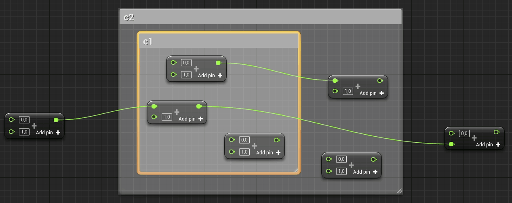
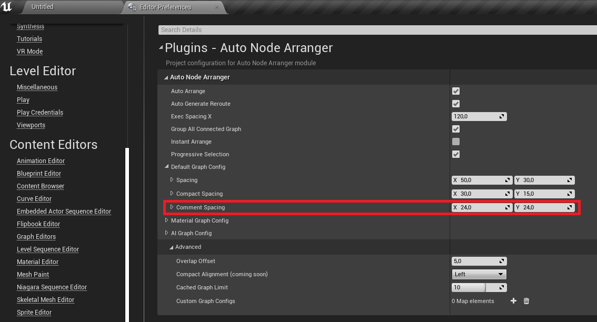
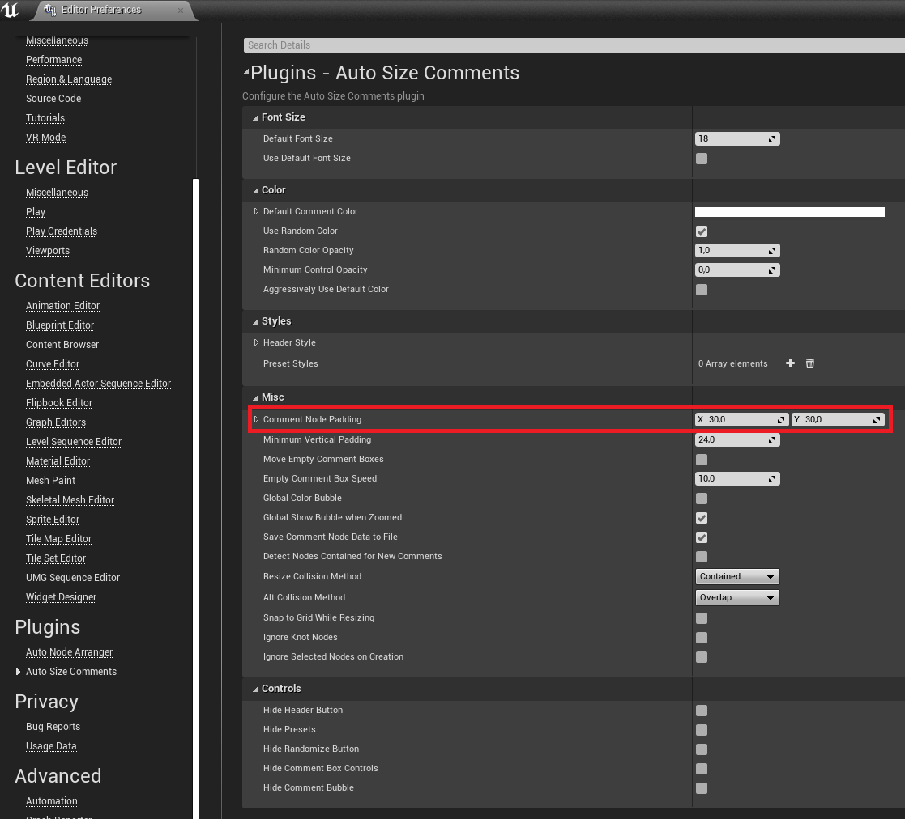

# Auto Node Arranger

## Presentation:

### Demo Video : https://youtu.be/l0ztFE0472k

**Marketplace link :** https://www.unrealengine.com/marketplace/en-US/slug/auto-node-arranger

With the Auto Node Arranger plugin, you can automatically arrange your graph nodes the way you want. The arrangement works for all graph types. You can customize the arrangement for having exactly the graph you want.

Please report any unexpected behaviours. It will be fixed as soon as possible. *(cf. [Contact-me](#5-Contact-me-1))*

**Support e-mail :** bstt.ue4@gmail.com

### Table of contents

#### 1. [Tips](#1-tips-1)

#### 2. [Commands : (default shortcut)](#2-Commands--default-shortcut-1)

##### 2.1. [Arrange](#21-Arrange-1)
###### 2.1.1. [Arrange Straight (Shift+Q)](#211-Arrange-Straight-ShiftQ-1)
###### 2.1.2. [Arrange Center (Shift+X)](#212-Arrange-Center-ShiftX-1)
###### 2.1.3. [Arrange Compact (Shift+V)](#213-Arrange-Compact-ShiftV-1)

##### 2.2. [Toggle Auto Arrange (Shift+Space)](#22-Toggle-Auto-Arrange-ShiftSpace-1)

##### 2.3. [Select Connected Graph (Shift+F)](#23-Select-Connected-Graph-ShiftF-1)

#### 2.4. [Register All Nodes (Shift+P)](#24-Register-All-Nodes-ShiftP-1)

##### 2.5. [Add Custom Graph Config (Shift+Enter)](#25-Add-Custom-Graph-Config-ShiftEnter-1)

#### 3. [Configuration](#3-Configuration-1)

##### 3.1. [Basic configuration](#31-Basic-configuration-1)
<!--
###### 3.1.1. [Auto arrange](#311-Auto-arrange-1)
###### 3.1.2. [Auto generate reroute](#312-Auto-generate-reroute-1)
###### 3.1.3. [Exec spacing](#313-Exec-spacing-1)
###### 3.1.4. [Group all connected graph](#314-Group-all-connected-graph-1)
###### 3.1.5. [Instant arrange](#315-Instant-arrange-1)
###### 3.1.6. [Progressive selection](#316-Progressive-selection-1)
-->
##### 3.2. [Graph configuration](#32-Graph-configuration-1)
<!--
###### 3.2.1. [Spacing](#321-Spacing-1)
###### 3.2.2. [Comment spacing](#322-Comment-spacing-1)
###### 3.2.3. [Arranged dimensions](#322-Arranged-dimensions-1)
-->
##### 3.3. [Advanced configuration](#33-Advanced-configuration-1)
<!--
###### 3.3.1. [Aligned pins offset](#331-Aligned-pins-offset-1)
###### 3.3.2. [Custom graph config](#333-Custom-graph-config-1)
-->
#### 4. [Node properties register](#4-Node-properties-register-1)
#### 5. [Contact me](#5-Contact-me-1)
#
### 1. Tips

The Arrange commands of ANA (Auto Node Arranger) work the same way **regardless of the selected nodes** in the connected graph(s) to arrange.

The arrangement **requires a first good sight** of all nodes that will be arranged in order to **not depend on the current zoom**.

All 'free' nodes that **aren't locked** are placed the most **on the right**.

The default commands have been chosen for their **compatibility with UE4 default settings**, but you can change it in ***Editor Preferences/General/Keyboard Shortcuts/Auto Node Arranger***.

[Table of contents](#Table-of-contents)

### 2. Commands : (default shortcut)

#### 2.1. Arrange

##### 2.1.1. Arrange Straight (Shift+Q)

ANA places all selected connected graphs with the minimum spacing required to aligned at the best all nodes.

##### 2.1.2. Arrange Center (Shift+X)

The only difference with Arrange Straight is that ANA tries to center each 'free' nodes.

##### 2.1.3. Arrange Compact (Shift+V)

ANA places a node below another on its right if it is not exec connected and it has less than 1 connected input pin and 1 connected output pin.

#### 2.2. Toggle Auto Arrange (Shift+Space)

You can enable/disable the [auto arrangement](#311-Auto-arrange-1) on pin connection.

#### 2.3. Select Connected Graph (Shift+F)

You can gradually select all connected nodes and comments of a graph.  
Press again **Shift+F** to increase the selection.

Show selection phasis

*At each step : Select all comments containing only selected nodes*
1. Select all nodes contained by selected comments
2. Select all nodes connected to selected nodes in selected comments
3. Select all nodes connected to selected nodes
4. Select all comment containing selected nodes

#### 2.4. Register All Nodes (Shift+P)

You can [register the size of all nodes](Gifs/2_41-RegisterAllNodes.gif) of the current graph.

If all nodes are registered you can simultaneously arrange multiple graph.

**Tip :** Use this command when many nodes are not registered (due to copy-paste or an implementation started without ANA)

#### 2.5. Add Custom Graph Config (Shift+Enter)

You can have as many different configurations as you want by graph type *(see [Custom graph config](#336-Custom-graph-config))*.

[Table of contents](#Table-of-contents)

### 3. Configuration

ANA has a lot of customizable options : you can change them in ***Editor Preferences/Plugins/Auto Node Arranger***.

#### 3.1. Basic configuration

##### 3.1.1. Auto arrange

If enabled, ANA automatically arranges nodes after a pin connection on deselection with the latest used arrange mode.

##### 3.1.2. Auto generate reroute

If enabled, ANA automatically generates reroute nodes for each loop connection.

**Tip :** reroute nodes are generated between the 2 nodes **the most 'negatively' spaced in X'.**

 

##### 3.1.3. Exec spacing

Exec Spacing is used between 2 nodes connected by exec pins.

 

##### 3.1.4. Group all connected graph

If enabled, ANA groups all connected graph.

 

##### 3.1.5. Instant arrange

If enabled, animation is disabled.

##### 3.1.6. Progressive selection

On Select Connected Graph (**Shift+F**),
- if enabled, the selection of nodes and comment is progresive
- if disabled, all nodes that are related to selection are selected.

#### 3.2. Graph configuration

##### 3.2.1. Spacing

Spacing is used with the Arrange Straight and Arrange Center commands whereas Compact Spacing is used with the Arrange Compact command.

 

##### 3.2.2. Comment spacing

Comment spacing is used between comment and nodes inside.

 

###### 3.2.2.1. 'Auto Size Comment' plugin compatibility

ANA is compatible with the **'Auto Size Comment'** plugin which is a plugin that automatically resize your comments.

**Link :** https://www.unrealengine.com/marketplace/en-US/product/auto-size-comments

The padding of 'Auto Size Comment' should be **equal to or lower than** the Comment spacing of 'Auto Node Arranger'

*Example with ASC Padding **equal to** ANA Spacing :*

*Example with ASC Padding **lower than** ANA Spacing :*

A padding **greater than** comment spacing can lead to this :

##### 3.2.3. Arranged dimensions

You can choose to arrange only in X, only in Y, or in both dimensions.

#### 3.3. Advanced configuration

##### 3.3.1. Aligned pins offset

ANA handles line overlap by adding an offset to node responsible of the overlap.

###### 3.3.1.1. Increase offset

You can increase the value in order to better discern the lines.

 

###### 3.3.1.2. Disable aligned pins

You can disable this feature by putting 0 as value for the aligned pins offset, and then lines can overlap. A solution is to create reroute nodes until the overlap disappears.

##### 3.3.2. Custom graph config

By default, there are 3 graph configs : the Material Graph config, the AI Graph config and the default Graph config used with all other graph types. You can add a custom graph config for one graph type with Add custom graph config command (Shift+Enter by default). ANA warns you when you already add this graph type, else it adds a new configuration which override the “default” graph config.

**Tip :** you can also override Material Graph config or AI Graph config.

[Table of contents](#Table-of-contents)

### 4. Node properties register

ANA stores the size of all nodes in the Node properties register: you can access it here : ***Project Settings/Plugins/Auto Node Arranger***.

There you can delete node properties that you don't need anymore.

### 5. Contact me

When you got an error :
- Save your project.
- Try to reproduce the error.  
- Fill this [template e-mail](Template_e_mail.md)
- Send it at this e-mail address : bstt.ue4@gmail.com

[Table of contents](#Table-of-contents)
