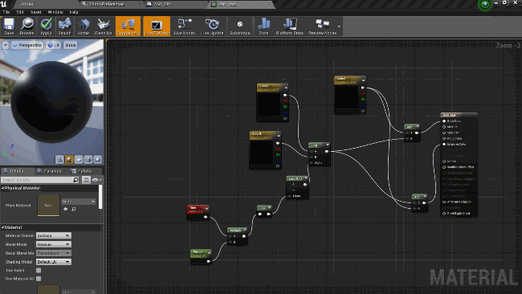
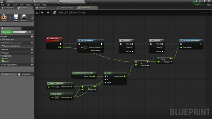
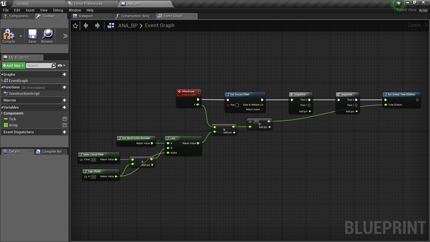
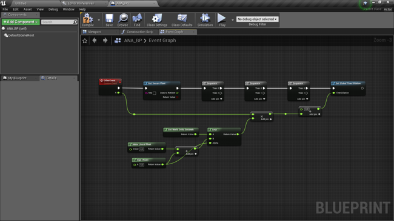
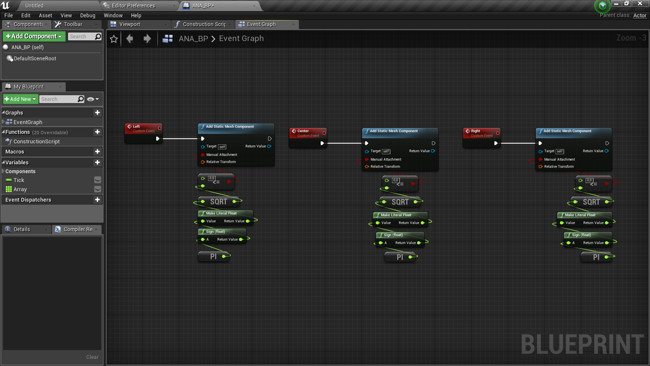
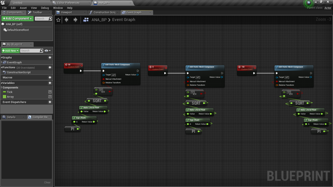

# Auto Node Arranger

## Presentation:

### [Demo Video](https://youtu.be/wM5r789cXNA)

Marketplace link : https://www.unrealengine.com/marketplace/en-US/slug/auto-node-arranger

With the Auto Node Arranger plugin, you can automatically arrange your graph nodes the way you want. The arrangement works for all graph types. You can customize the arrangement for having exactly the graph you want.

Please report any unexpected behaviours. It will be fixed as soon as possible.

Support link : https://forums.unrealengine.com/unreal-engine/marketplace/1630487-auto-node-arranger

Support e-mail : bstt.ue4@gmail.com

## Documentation:

### Table of contents

#### 1. [Tips](#1-tips-1)

#### 2. [Commands: (default shortcut)](#2-Commands-default-shortcut-1)

##### 2.1. [Arrange](#21-Arrange-1)
###### 2.1.1. [Arrange Straight (Shift+Q)](#211-Arrange-Straight-ShiftQ-1)
###### 2.1.2. [Arrange Center (Shift+X)](#212-Arrange-Center-ShiftX-1)
###### 2.1.3. [Arrange Compact (Shift+V)](#213-Arrange-Compact-ShiftV-1)

##### 2.2. [Toggle Auto Arrange (Shift+Space)](#22-Toggle-Auto-Arrange-ShiftSpace-1)

##### 2.3. [Toggle Group Nodes (Shift+G)](#23-Toggle-Group-Nodes-ShiftG-1)

##### 2.4. [Select Connected Graph (Shift+F)](#24-Select-Connected-Graph-ShiftF-1)

##### 2.5. [Add Custom Graph Config (Shift+Enter)](#25-Add-Custom-Graph-Config-ShiftEnter-1)

#### 3. [Configuration](#3-Configuration-1)

##### 3.1. [Basic configuration](#31-Basic-configuration-1)
<!--
###### 3.1.1. [Auto arrange](#311-Auto-arrange-1)
###### 3.1.2. [Auto generate reroute](#312-Auto-generate-reroute-1)
###### 3.1.3. [Exec spacing](#313-Exec-spacing-1)
###### 3.1.4. [Compact Mode type](#314-Compact-Mode-type-1)
-->
##### 3.2. [Graph configuration](#32-Graph-configuration-1)
<!--
###### 3.2.1. [Spacing](#321-Spacing-1)
###### 3.2.2. [Arranged dimensions](#322-Arranged-dimensions-1)
-->
##### 3.3. [Advanced configuration](#33-Advanced-configuration-1)
<!--
###### 3.3.1. [Nodes on Right by Default](#331-Nodes-on-Right-by-Default-1)
###### 3.3.2. [Reroute lock node](#332-Reroute-lock-node-1)
###### 3.3.3. [Aligned pins offset](#333-Aligned-pins-offset-1)
###### 3.3.4. [Compact alignment](#334-Compact-alignment-1)
###### 3.3.5. [Compact offset](#335-Compact-offset-1)
###### 3.3.6. [Custom graph config](#336-Custom-graph-config-1)
-->
#### 4. [Group register](#4-Group-register-1)
#
### 1. Tips

The Arrange commands of ANA (Auto Node Arranger) work the same way **regardless of the selected nodes** in the connected graph(s) to arrange.

The arrangement depends on the current zoom of the graph since the size of the nodes also **depends on the current zoom**.

ANA tries to keep the **Y position order**.  
ANA tries to order in Y position according to the **order of the pins**.

The default commands have been chosen for their **compatibility with UE4 default settings**, but you can change it in ***Editor Preferences/General/Keyboard Shortcuts/Auto Node Arranger***.

[Table of contents](#Table-of-contents)

### 2. Commands: (default shortcut)

#### 2.1. Arrange

##### 2.1.1. Arrange Straight (Shift+Q)

ANA places all selected connected graphs with the minimum spacing required to aligned at the best all nodes.

##### 2.1.2. Arrange Center (Shift+X)

The only difference with Arrange Straight is that ANA tries to center each 'free' nodes.

##### 2.1.3. Arrange Compact (Shift+V)

ANA places all exec nodes with the minimum spacing required and places all 'free' nodes one below the other according to the [Compact mode types](#314-Compact-Mode-type-1).

#### 2.2. Toggle Auto Arrange (Shift+Space)

You can enable/disable the auto arrangement on pin connection.

#### 2.3. Toggle Group Nodes (Shift+G)

You can group/ungroup nodes to lock the relative location between nodes for the arrangement.

When you select a node of a group, ANA automatically selects the group of this node. If you want to select only one node of this group, click again on the node that you want to select.

**NB:** You can hold ctrl to select/unselect a node.

**Tip:** Since the arrangement depends on the node size, it is recommended to **group nodes that are out of your sight** when you are arranging a big graph.

#### 2.4. Select Connected Graph (Shift+F)

You can select all connected nodes of a graph.

**NB:** groups are ignored.

#### 2.5. Add Custom Graph Config (Shift+Enter)

You can have as many different configurations as you want by graph type *(see [Custom graph config](#336-Custom-graph-config))*.

<!--TODO gif (arrange + create + change spacing + arrange)-->

[Table of contents](#Table-of-contents)

### 3. Configuration

ANA has a lot of customizable options: you can change them in ***Editor Preferences/Plugins/Auto Node Arranger***.

#### 3.1. Basic configuration

##### 3.1.1. Auto arrange

If enabled, ANA automatically arrange nodes on pin connection with the last arrange mode used.

##### 3.1.2. Auto generate reroute

If enabled, ANA automatically generate reroute nodes for each loop connection.

**Tip:** reroute nodes are generated between the 2 nodes **the most 'negatively' spaced in X'.**

 

##### 3.1.3. Exec spacing

Exec Spacing is used between 2 nodes connected by exec pins.

 

##### 3.1.4. Compact Mode type

###### 3.1.4.1. Semi-Compact

ANA places one node below the other only if it is not an exec node and it has less than 1 connected input pin and 1 connected output pin.

###### 3.1.4.2. Compact

The only difference with the Semi-Compact type is that if an exec node has less than 1 non-exec-connected input pin, the connected node is placed below.

###### 3.1.4.3. Full compact

Only exec nodes aren't placed below another node.

#### 3.2. Graph configuration

##### 3.2.1. Spacing

Spacing is used with the Arrange Straight and Arrange Center commands whereas Compact Spacing is used with the Arrange Compact command.

 

##### 3.2.2. Arranged dimensions

You can choose to arrange only in X, only in Y, or in both dimensions.

#### 3.3. Advanced configuration
 
##### 3.3.1. Nodes on Right by Default

All 'free' nodes that aren't locked *(see [Reroute lock node](#332-Reroute-lock-node))* are placed the most on the right if enabled, on the left if disabled.

 

##### 3.3.2. Reroute lock node

If enabled, 1-output reroute nodes lock **all 'free' nodes** on the oppsite direction. 

*Reroute Node Lock On (Nodes on Right)*

If disabled, **only the 1-output reroute nodes** are placed on the opposite direction.

*Reroute Node Lock Off (Nodes on Right)*

##### 3.3.3. Aligned pins offset

ANA handles line overlap by adding an offset to node responsible of the overlap.

###### 3.3.3.1. Increase offset

You can increase the value in order to better discern the lines.

 

###### 3.3.3.2. Disable aligned pins

You can disable this feature by putting 0 as value for the aligned pins offset, and then lines can overlap. A solution is to create reroute nodes until the overlap disappears.

##### 3.3.4. Compact alignment

You can align compacted nodes to the left or right borders of the parent node, or centers them with the parent node.

##### 3.3.5. Compact offset

You can add an offset to shift the alignment *(positive value for left, negative for right)*.

##### 3.3.6. Custom graph config

By default, there are 3 graph configs: the Material Graph config, the AI Graph config and the default Graph config used with all other graph types. You can add a custom graph config for one graph type with Add custom graph config command (Shift+Enter by default). ANA warns you when you already add this graph type, else it adds a new configuration which override the “default” graph config.

**Tip:** you can also override Material Graph config or AI Graph config.

[Table of contents](#Table-of-contents)

### 4. Group register

ANA store all created groups in the Group register: you can access it in ***Project Settings/Plugins/Auto Node Arranger***.

There you can delete groups that you don't need anymore.

<!--TODO gif (create 2 groups + show register + delete group (command) + show register + arrange + delete group in register + arrange)-->

[Table of contents](#Table-of-contents)
